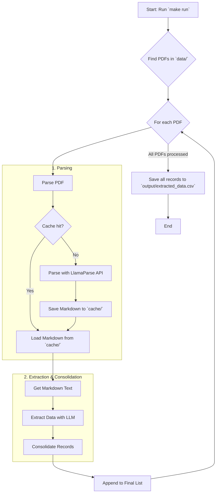

# TRACERA: ESG Data Extractor


This project is an automated data extraction pipeline designed to parse PDF utility bills, extract key information using LLMs, and save the structured data into a CSV file. It leverages LlamaParse for high-fidelity document-to-markdown conversion and supports both Gemini and OpenAI models for the core extraction logic.

## Key Technologies

- **PDF Parsing**: [LlamaParse](https://github.com/run-llama/llama_parse) for OCR-powered document-to-markdown conversion.
- **LLM Services**: [Google Gemini](https://ai.google.dev/) or [OpenAI GPT](https://openai.com/) for intelligent data extraction.
- **Data Validation**: [Pydantic](https://docs.pydantic.dev/) for defining data schemas and ensuring type safety.
- **Package Management**: [uv](https://github.com/astral-sh/uv) for fast dependency installation and management.
- **Containerization**: [Docker](https://www.docker.com/) for building and running the application in a portable environment.
- **Development Tools**: `make`, `ruff` for linting/formatting, `pytest` for testing.

## Project Flow

The entire data extraction process is designed as a sequential pipeline. Here’s a step-by-step breakdown of the workflow from input to output.




1.  **PDF Discovery**: The process starts by scanning the `data/` directory for all PDF files.
2.  **Parsing & Caching**: Each PDF is passed to the `PDFParser`.
    -   A unique hash is generated for the file. If a cached markdown version with the same hash exists in the `cache/` directory, it's used instantly, skipping the parsing step.
    -   If not cached, the PDF is sent to the **LlamaParse API** for OCR and conversion to markdown. The result is then saved to the cache for future runs.
3.  **Data Extraction**: The clean markdown text is sent to the `LLMService`.
    -   An LLM (**Gemini** or **OpenAI**) processes the text against a predefined Pydantic schema to extract relevant data points (e.g., `invoice_number`, `total_amount`).
4.  **Data Consolidation**: The raw extracted records are passed through a consolidation step. This step uses another LLM call to intelligently merge duplicate or partial records from the same document into a single, complete record, ensuring data integrity.
5.  **Output Generation**: The final, clean records from all processed PDFs are collected and saved into a single CSV file located at `output/extracted_data.csv`.

## Features

- **Advanced PDF Parsing**: Utilizes LlamaParse for robust, OCR-powered parsing of PDF documents into a clean markdown format.
- **Intelligent Data Extraction**: Employs LLMs (configurable for Gemini or OpenAI) to accurately extract predefined fields from unstructured text.
- **Data Consolidation**: Includes a smart consolidation step to merge and de-duplicate records extracted from different parts of a single document.
- **Efficient Caching**: Caches parsed document content to significantly speed up subsequent processing runs.
- **Structured Output**: Saves the final, cleaned data to a CSV file in the `output/` directory.
- **Streamlined Workflow**: Comes with a `Makefile` providing simple commands for setup, execution, and code quality checks.

## Project Structure

```bash
.
├── data/                  # Input directory for source PDF files.
├── output/                # Output directory for the extracted CSV data.
├── cache/                 # Caches parsed markdown files to accelerate reruns.
├── src/                   # Main source code.
│   ├── config.py          # Project configuration (API keys, paths, models).
│   ├── main.py            # Main entry point for the application.
│   ├── schemas.py         # Pydantic models for structured data.
│   └── utils/             # Core utility modules.
│       ├── data_extractor.py # Orchestrates the extraction process.
│       ├── file_handler.py   # Handles file I/O (reading PDFs, saving CSV).
│       ├── llm_service.py    # Manages interaction with the LLM APIs.
│       └── pdf_parser.py     # Handles PDF parsing using LlamaParse.
├── tests/                 # Unit and integration tests.
├── Makefile               # Commands for running, testing, and formatting.
├── pyproject.toml         # Project metadata and dependencies.
├── requirements.txt       # Pinned Python dependencies generated by uv.
└── README.md              # This file.
```

## Setup and Installation

### Prerequisites

- **Python 3.12**: The project requires Python 3.12, as specified in the `.python-version` file.
- **uv**: This project uses `uv` for fast Python package management.

  You can install `uv` using the official installers:
  - **macOS / Linux**:
    ```bash
    curl -LsSf https://astral.sh/uv/install.sh | sh
    ```
  - **Windows**:
    ```bash
    powershell -c "irm https://astral.sh/uv/install.ps1 | iex"
    ```
  - Alternatively, you can install it via `pip`:
    ```bash
    pip install uv
    ```

### Installation Steps

1.  **Clone the repository:**
    ```bash
    git clone <repository-url>
    cd tracera-coding-assessment
    ```

2.  **Create a virtual environment:**
    ```bash
    uv venv --python 3.12
    source .venv/bin/activate
    ```

3.  **Install dependencies:**

    - **Using `uv` (Recommended):**
      The `sync` command ensures your environment matches the lock file exactly.
      ```bash
      # Install main and development dependencies
      uv pip sync
      ```

    - **Using `pip`:**
      If you prefer not to use `uv`, you can use pip:
      ```bash
      pip install -r requirements.txt
      ```

## Environment Variables

You need to configure API keys for the services used in this project.

1.  **Create a `.env` file** by copying the example file:
    ```bash
    cp .env.example .env
    ```

2.  **Edit the `.env` file** and add your API keys:
    - `LLAMA_CLOUD_API_KEY`: **(Required)** For parsing PDFs with LlamaParse.
    - `GEMINI_API_KEY` or `OPENAI_API_KEY`: **(Required)** You must provide at least one of these for the data extraction LLM. The project prioritizes Gemini if both are set.

    ```env
    # .env
    GEMINI_API_KEY=AI-...
    OPENAI_API_KEY=sk-...         # Optional
    LLAMA_CLOUD_API_KEY=llx-...
    ```

## Usage

The primary way to run the data extraction pipeline is by using the `make run` command.

1.  **Place your PDF files** into the `data/` directory.
2.  **Run the extraction process:**
    ```bash
    make run
    ```
    This command will process all PDF files in the `data` directory, extract the relevant information, and save the results to `output/extracted_data.csv`.

## Running with Docker

This project is fully containerized, allowing you to build and run it using Docker without needing to manage Python environments locally.

### Prerequisites

- [Docker](https://docs.docker.com/get-docker/) installed and running on your system.

### Build the Docker Image

From the project root directory, run the following command to build the Docker image:

```bash
docker build --no-cache -t tracera-extractor .
```

### Run the Container

After building the image, you can run the data extraction pipeline inside a container. Make sure your `.env` file is populated with the required API keys.

```bash
docker run --rm --env-file .env -v ./data:/app/data -v ./output:/app/output -v ./cache:/app/cache tracera-extractor
```

#### Command Explanation:

- `docker run`: The command to start a new container.
- `--rm`: Automatically removes the container when it exits, keeping your system clean.
- `--env-file .env`: Passes the environment variables from your local `.env` file into the container.
- `-v ./data:/app/data`: Mounts the local `data` directory (containing input PDFs) into the container's `/app/data` directory.
- `-v ./output:/app/output`: Mounts the local `output` directory into the container. The application will write the final `extracted_data.csv` here.
- `-v ./cache:/app/cache`: Mounts the local `cache` directory to persist parsed documents between runs, improving performance.
- `tracera-extractor`: The name of the image to run.

For interactive mode:
```bash
docker run --rm -it --env-file .env -v ./data:/app/data -v ./output:/app/output -v ./cache:/app/cache --entrypoint bash tracera-extractor
# Now you are inside the container, you can run the app with:
uv run python -m src.main
```

## Interactive Walkthrough

For a detailed, step-by-step guide through the entire data extraction pipeline, you can use the interactive Jupyter Notebook provided in this project.

- **Location**: `Notebook/project_walkthrough.ipynb`

This notebook explains each component, from parsing PDFs to the final data consolidation, with runnable code cells that allow you to inspect the output at every stage.

### How to Run the Notebook

1.  Ensure you have installed the project dependencies (`uv pip sync`).
2.  Make sure your `.env` file is correctly set up with the required API keys.
3.  Launch Jupyter Lab or Jupyter Notebook from your terminal:

    ```bash
    # To launch Jupyter Lab
    uv run jupyter lab
    ```
    or
    ```bash
    # To launch Jupyter Notebook
    uv run jupyter notebook
    ```
4.  Once Jupyter opens in your browser, navigate to the `Notebook/` directory and open the `Project_Walkthrough.ipynb` file.

## Makefile Commands

The project includes a `Makefile` with several commands to streamline development and execution:

| Command | Description |
| :--- | :--- |
| `make run` | Executes the main data extraction pipeline. |
| `make test` | Runs the entire test suite using `pytest`. |
| `make coverage` | Runs tests and generates a detailed coverage report. |
| `make format` | Formats the codebase using `ruff format`. |
| `make lint` | Lints the code for style and errors using `ruff check`. |
| `make clean` | Removes temporary files and caches (`__pycache__`, `.pytest_cache`, etc.). |
